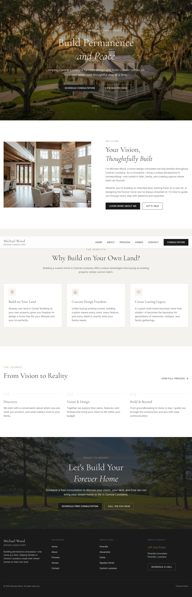

# Michael Wood

### Home Design Consultant · Pineville, Louisiana

> **Build permanence and peace—one home at a time.**
> Because moving into a house that doesn't make you happy is a very expensive way to discover you should have thought about it first.

A marketing website for **Michael Wood**, a home design consultant helping families across **Central Louisiana (Cenla)** turn *“we've been thinking about building…”* into an actual plan.

**Live site:** https://dumbdancin.netlify.app
**GitHub:** https://github.com/andymutale/dumbdancin

---

## What is this?

A five-page website for a guy who helps people build custom homes on their own land.

Which sounds straightforward.

It is not.

There are floor plans.
There are budgets.
There are opinions.
There is your spouse's Pinterest board.
There is your uncle who *“knows a guy.”*

Michael's job is to bring some order to all of that.

The website explains **who he is, how he works, what kinds of homes he designs, and how to start a conversation without committing to a 47-page questionnaire.**

---

## The pages

```text
/             Home
/about        About Michael
/process      How this whole thing works
/homes        Houses! Actual houses!
/contact      Talk to Michael
```

### `/`

The homepage answers the important questions:

* Who is this guy?
* Why should I build?
* What does the process look like?
* How do I get started?

Also includes a hero, intro, process preview, and a polite but persistent call to action.

### `/about`

Michael's story, background, approach, and values.

In other words: **the part where you discover he's a real person and not an AI-generated contractor named Chad.**

### `/process`

A step-by-step walkthrough of the custom-home journey.

Because *“first we talk, then somehow there's a house”* is technically a process, but not a particularly comforting one.

### `/homes`

A gallery of home concepts and architectural styles, including things like:

* Craftsman
* Modern Farmhouse
* Other handsome houses people point at and say, “Yep. That one.”

### `/contact`

A consultation request form and contact information.

The website's version of:

> **“Enough looking at pretty houses. Let's talk.”**

---

## The vibe

The design aims for:

**Warm** — homes are personal.

**Editorial** — big typography, photography, whitespace.

**Grounded** — no neon gradients screaming *LIMITED-TIME BUILDER SPECIAL!!!*

**Confident** — clear information without shouting.

**Slightly fancy** — because apparently houses deserve good typography.

### Fonts

`Inter` handles the practical stuff.

`Cormorant Garamond` handles the *“we care deeply about architectural proportion”* stuff.

It's a good division of labor.

---

## Tech stack

```text
Next.js 16        React framework
React 19          UI
TypeScript        Types, because chaos isn't a type system
Tailwind CSS v4   Styling
shadcn/ui         Components
Radix UI          Accessible primitives
Lucide            Icons
React Hook Form   Forms
Zod               Validation
Vercel Analytics  Analytics
Netlify           Deployment
```

Yes, there is quite a bit of technology involved in a website whose primary job is to say:

> **“Want to build a house?”**

That is modern web development for you.

---

## Project structure

```text
app/
├── about/
├── contact/
├── homes/
├── process/
├── layout.tsx
├── page.tsx
├── robots.ts
└── sitemap.ts

components/
├── ui/
└── ...

hooks/
lib/
public/
└── images/

styles/
```

It's a fairly sensible structure.

Please don't be the person who puts an entire page inside `components/ui/`.

We can all do better.

---

## Run it locally

### Requirements

* Node.js 18.18+
* Node.js 20+ recommended
* npm or pnpm
* A terminal
* The ability to read error messages without immediately blaming Tailwind

### Install

```bash
git clone https://github.com/andymutale/dumbdancin.git
cd dumbdancin
npm install
```

Or:

```bash
pnpm install
```

Pick one package manager.

The repository currently has both `package-lock.json` **and** `pnpm-lock.yaml`, because apparently we enjoy keeping our options open.

### Start development

```bash
npm run dev
```

Then visit:

**http://localhost:3000**

Congratulations. You are now looking at the website on your own computer.

### Production build

```bash
npm run build
npm run start
```

### Lint

```bash
npm run lint
```

The linter has no feelings.

It will, however, tell you what you did wrong.

---

## SEO

The site is set up to be discoverable by people searching for home design help around **Pineville and Central Louisiana**.

Included:

* Per-page SEO metadata
* LocalBusiness JSON-LD structured data
* `sitemap.ts`
* `robots.ts`
* Location-aware content
* Semantic page structure

The dream is that someone searches:

> **“home design consultant Cenla”**

and finds Michael instead of a blog post from 2017 telling them to “ask their builder.”

---

## Contact form

The contact form currently **pretends** to submit.

It validates the form, waits a little, and shows a success state.

Which is great for a demo.

Less great when an actual human submits:

> “Hey, we'd like to build a house.”

…and the submission disappears into the digital wilderness.

### Before launch

Connect the form to:

```text
Contact form
    ↓
API / serverless function
    ↓
Email or CRM
    ↓
Actual human being
    ↓
Nice house
```

A real backend would be a meaningful next step.

---

## Things that could be better

### Images are unoptimized

Current config:

```js
images: {
  unoptimized: true
}
```

It works.

It is also basically telling your image pipeline:

> “We'll take it from here, champ.”

Consider proper image optimization or a CDN before the site gets ambitious.

### TypeScript errors are ignored

Current config:

```js
typescript: {
  ignoreBuildErrors: true
}
```

This is convenient.

It is also the software equivalent of putting electrical tape over the check-engine light.

Eventually, remove it and fix the underlying issues.

### Two package managers

Currently:

```text
package-lock.json
pnpm-lock.yaml
```

Pick one.

The codebase does not need a custody battle.

### The package name

Package:

```text
michael-wood-design-consultant
```

Repository:

```text
dumbdancin
```

This is not technically a problem.

It is, however, a fun little mystery for the next developer.

---

## Screenshots

### Home



### Process


### Contact


### Tablet


### Mobile


---

## Roadmap

### 1. Make leads real

Connect the contact form to an actual email service or CRM.

### 2. Make images faster

Optimize large assets and improve loading performance.

### 3. Make builds stricter

Remove `ignoreBuildErrors`.

### 4. Show more homes

Add project case studies, galleries, and eventually enough examples that visitors can say:

> “I want that.”

### 5. Measure what matters

Track consultation requests and meaningful interactions—not just how many people successfully located the hamburger menu.

---

## Philosophy

A website for a home design consultant should probably feel a little like a well-designed home.

Calm.

Intentional.

Thoughtful.

Not trying too hard.

And ideally built to last longer than the average `node_modules` folder.

---

## License

There is currently no license file.

If this project is going to be reused or open-sourced, add one.

**MIT** would be a reasonable permissive choice.

---

## Built for

**Michael Wood**
Home Design Consultant
Pineville, Louisiana · Central Louisiana

**Build permanence and peace—one home at a time.**

And, ideally, avoid spending six figures learning that the kitchen should have had more outlets.

---

### Made with

`Next.js` · `React` · `TypeScript` · `Tailwind CSS` · `shadcn/ui` · `Lucide`

### Made for

People who want a home they actually want to come home to.

### Made hopefully before

The next “quick little change” turns into a complete rebuild.
---

---

<div align="center">


### ADARETH LABS

**Digital product design · Engineering · Systems architecture**

> **Build the system, not just the screen.**

</div>


